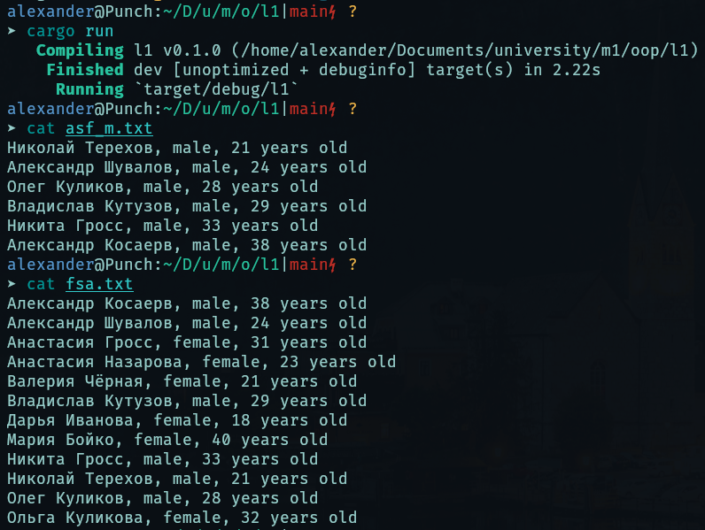

# Лаба №1

_Создать список экземпляров объекта и отсортировать его разными способами._

Во время работы программы создаётся список клиентов, который затем дважды сортируется и после каждого раза записывается в файл.

1. `fsa.txt`, в котором клиенты отсортированы по фамилии, имени, возрасту.
2. `asf_m.txt`, в котором представлены клиенты-мужчины, отсортированные по возрасту, фамилии, имени.

