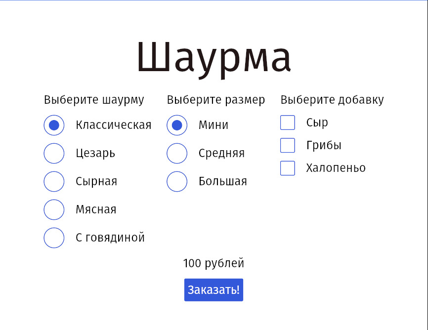

# Лаба №2

_Создать GUI-приложение, в котором производится расчёт чего-то._

Разработано приложение, которое расчитывает стоимость шаурмы основываясь на её типе, размере и добавках. Расчсёт производится автоматически. Кнопка __Заказать!__ меняется на текст при нажатии, и обратно в кнопку при изменении шаурмы.

Приложение создано с использованием [iced](https://github.com/iced-rs/iced).

