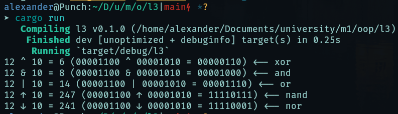

# Лаба 3

_Создать приложение для вычислений чего-либо с использованием интерфейсов._

Разработано приложение с бинарными операциями `AND`, `OR`, `XOR`, `NAND`, `NOR`. Все эти операции используют интерфейс `Operation`. Вывод программы осуществляется в консоль.

