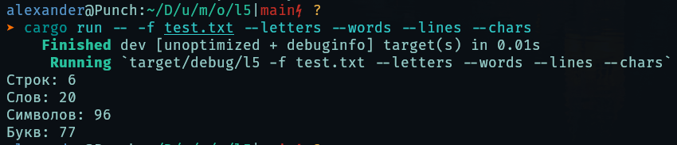

# Лаба 5

_Создать приложение, в котором может быть обработано исключение._

В Rust нет исключений, но для обработки ошибок и информировании об результате работы методов/функций используется структура данных `Result`. `Result` это перечисление, которое принимает два значения: `Ok` и `Err`. В первом случае `Result` содержит результат выполнения метода/функции, а во втором ошибку. Ошибкой может считаться всё, что угодно, но обычно это то, что реализует типаж `Error`.

В рамках работы создано консольное приложение, которое может подсчитать в файле количество строк, слов, символов и букв. Для парсинга аргументов командной строки использовалась библиотека [clap](https://github.com/clap-rs/clap).

Тестовый файл:

```txt
У попа была собака,
Он её любил,
Она съела кусок мяса,
Он её убил.
В землю закопал
И надпись написал:
```

