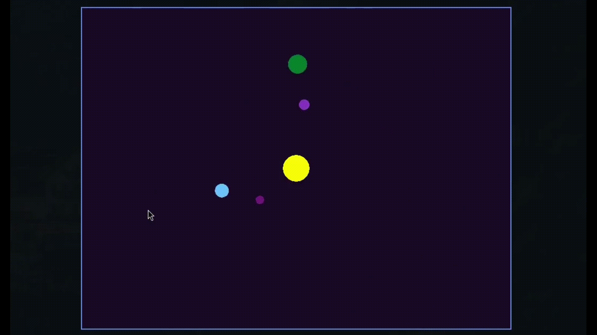

# Лаба 6

_Написать многопоточное приложение._

В рамках работы было написано простое интерактивное приложение с использованием фреймворка [macroquad](https://github.com/not-fl3/macroquad). Можно с помощью стрелочек управлять большим жёлтым шаром, вокруг которого летает множество маленьких. Каждый шарик просчитывается в отдельном потоке.

