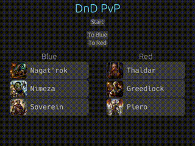

# Лаба 7

_Создать приложение с лобби._

В рамках работы было написано простое интерактивное приложение с использованием библиотеки [egui](https://github.com/emilk/egui/tree/master). Можно перемещать героев по командам с помощью соответствующих кнопок и "начать игру".

